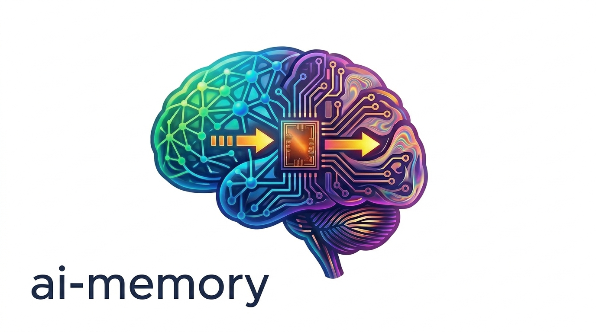

<p align="center">
  <picture>
    <source media="(prefers-color-scheme: dark)" srcset="docs/logo-dark.png">
    
  </picture>
</p>

> Long-term memory for AI coding agents. Quit Claude Code mid-task,
> start OpenAI Codex in the same directory, continue without
> re-explaining the architecture, the failed approaches, or the open
> questions.

[](https://github.com/akitaonrails/ai-memory/releases/latest)
[](rust-toolchain.toml)
[](LICENSE)

## Why ai-memory

Your coding agent already has a memory feature. Claude Code takes its own
notes, Cursor remembers some things, and every platform is adding more. All
of them share the same walls: the notes live on one machine, belong to one
agent, and vanish from view the moment you switch tools — or teammates.

ai-memory is what's on the other side of those walls.

- **It follows you across agents.** Twenty-plus harnesses — Claude Code,
  Codex, Cursor, Gemini CLI, OpenCode, Grok, Devin, Kimi, Kiro, and more —
  feed one shared memory. Quit Claude Code mid-task, open Codex in the same
  directory, and the next agent picks up a real handoff: where you left
  off, what failed, what's still open. Handoffs are a protocol here, not a
  convention — typed, owned, claimed exactly once.

- **It follows you across machines.** Memory lives in a server you run —
  on the same laptop, a homelab box, or wherever — so the project you left
  on the desktop is the project you resume on the laptop. Same knowledge,
  same open questions.

- **It works for a team.** Point everyone at one server and what one
  person's sessions learn, everyone's agents can retrieve. Knowledge is
  shared per project; personal handoffs stay personal. Multi-user auth,
  per-person attribution, and an audit log are built in — not a paid tier.

- **Your memory is plain markdown.** The source of truth is a git-backed
  wiki of ordinary `.md` files: `grep` it, open it in Obsidian, edit it by
  hand, `rsync` it. The database is a derived index that can always be
  rebuilt from the files. No vector store to babysit, nothing held hostage
  in a binary blob.

- **It captures the work itself, silently.** Lifecycle hooks record what
  actually happened — prompts, tool calls, session boundaries — sanitized
  at a typed privacy boundary before anything is stored, then consolidated
  into readable pages. No "remember this" ceremony. And the default path
  uses **zero LLM calls**: capture, search, and handoffs all work with no
  API key at all.

- **It ages gracefully, without an LLM.** Memory decays on a schedule you
  can tune per tier, and the memory you actually use decays *slower* — open a
  page, search it, or reach it through a link and it earns its keep. When
  episodic notes go cold they can be compacted down to their durable facts
  (file paths, error codes, decisions) instead of dropped, near-duplicates
  collapse into one, and likely contradictions get flagged — all with **zero
  API calls**. Nothing is hard-deleted: the original stays in git and the
  version chain (`restore-page` brings it back). Access-weighted retention is
  always on because it can only ever keep memory *longer*; the parts that
  rewrite or drop content (compaction, dedup, per-tier curves) stay off by
  default until you turn them on.

- **And it can dream, if you let it.** Point it at an LLM and an opt-in
  background pass will, while you're idle, rewrite whole clusters of cold
  notes into single coherent pages — cancelling the moment you come back to
  work. It never deletes a source (the pre-merge versions stay reachable),
  it's off by default, and it's gated on a recall eval before it could ever
  become default behavior. The zero-LLM path above is what runs unless you
  ask for more.

- **It tells you the truth about itself.** One self-contained binary.
  Purge commands that say exactly what "deleted" means. A measured write
  ceiling (~700/s) instead of a guessed one. An audit log of every
  mutation. Boring, in the way infrastructure should be.

## How it works

```
capture ──▶ consolidate ──▶ recall ──▶ handoff
 hooks        session-end      search     next agent,
 observe      summaries as     + brief    any harness
 silently     wiki pages       injection
```

Agents emit sanitized observations through lifecycle hooks as you work.
At session end, observations become coherent markdown pages in the
project's wiki (optionally LLM-written; useful even without). The next
session — any agent, any machine — gets a bounded brief and can search
everything: full-text, entities, links, and (optionally) vectors, fused
into one ranking. Cross-agent handoffs carry the baton explicitly.

The full design, including the invariants that keep multi-user and
multi-session use safe, is in [`docs/ARCHITECTURE.md`](docs/ARCHITECTURE.md).

## Support matrix

Every row below is a first-party integration — MCP registration, lifecycle
hooks, or both — kept honest by CI. The full matrix with per-agent notes and
caveats is in [`docs/support-matrix.md`](docs/support-matrix.md).

| Area | Status |
| --- | --- |
| Linux | Supported |
| macOS | Supported |
| Windows via WSL2 | Supported |
| Native Windows | Experimental |
| Claude Code | Supported |
| Codex | Supported |
| Command Code | Supported |
| Devin CLI | Supported |
| OpenCode | Supported |
| OpenCode 2 (`opencode2` beta) | Supported |
| Cursor | Supported |
| Gemini CLI | Supported |
| Oh My Pi / OMP | Supported |
| Pi | Supported |
| Crush | Managed-only |
| Managed workstreams | Opt-in |
| Claude Desktop | MCP-only |
| OpenClaw | Supported |
| Antigravity CLI | Supported |
| Grok Build CLI | Supported |
| Swival CLI | MCP-only |
| Zero | Supported |
| ZCode | Supported |
| Kimi Code | Supported |
| Kiro CLI | Supported |
| Pool | Hooks-only |
| VS Code Copilot | MCP-only |
| Zed | MCP-only |
| Muse Code | MCP-only |
| Hermes Agent | Supported |
| LLM/auth providers | Supported |
| Embedding providers | Supported |

## Coming from another tool?

Most agent-memory tools optimize one thing — extracting atomic facts per turn,
a temporal knowledge graph, an agent-editable memory OS, or a hosted context
API. ai-memory optimizes something different: a **git-backed markdown wiki as
the source of truth**, with a derived index for retrieval, captured
automatically from lifecycle hooks, shared across agents, machines, and people,
and working with **zero LLM calls by default**. Here's what carries over from
each, and what you gain:

| Coming from… | What's similar | What you gain |
|---|---|---|
| **Mem0 / fact extractors** (LangMem) | Automatic per-turn capture | Memory compiles into readable **pages** you own and edit, not opaque fact rows; retrieval fuses FTS + entity + graph (+ optional vectors), not vector-only |
| **Zep / Graphiti** (temporal KG) | Temporal reasoning, typed relations | Bi-temporal-lite (`as_of`, version-filtered search) and typed edges without standing up a graph database — on one binary |
| **mcp-memory-service** (closest sibling) | SQLite + local embeddings, hook capture, typed edges, honest numbers — and, on 2.4, per-tier decay curves, extractive compression, DBSCAN cold-cluster dedup, access reinforcement, and contradiction flagging | Human-editable markdown **pages** instead of fact-rows, cross-agent claim-once handoffs, and the same aging machinery done **zero-LLM by default, reversibly** (supersede-not-delete + `restore-page`), and **off by default** |
| **basic-memory** (file-first sibling) | Markdown-on-disk as the source of truth | Automatic lifecycle capture and a derived FTS/entity/graph index on top, cross-agent handoffs, and multi-user sharing built in |
| **Claude Code built-in memory** | "Remember my project" convenience, zero setup | Synced across machines and agents, searchable, team-capable, and captures tool lifecycle — not a per-laptop `MEMORY.md` |
| **Hindsight / OpenViking** (hosted, LLM-required) | Living pages / document memory with a background consolidation loop — and, on 2.4, belief-strength confidence plus an opt-in LLM "dream" rewrite of cold clusters | A self-contained binary that runs zero-LLM by default and keeps memory in files you own; per-project team sharing instead of strict per-bank isolation; the dream/belief features are **opt-in, off by default, and never delete a source** (vs a mandatory LLM loop) |
| **Supermemory / LiquidLM** (hosted memory API) | A managed second brain with automatic ingestion | Git-versioned markdown you own, no required API spend, offline operation, and per-project team sharing — ai-memory remembers *this repo*, not a general vault |

The consistent theme: **files you own** (git-backed markdown), a **zero-LLM
default**, **one self-contained binary**, **cross-agent + cross-machine + team**
sharing, **automatic lifecycle capture**, and **typed, claim-once handoffs**.
Opt-in features (LLM consolidation, vector search, the "dream" consolidation
pass, belief-strength in ranking) stay opt-in — and the zero-LLM aging path
(per-tier decay, extractive compaction, dedup, contradiction flagging,
access-weighted retention) works with no API key at all.

**Built on the shoulders of:** the
[Karpathy LLM Wiki](https://gist.github.com/karpathy/442a6bf555914893e9891c11519de94f)
(compile-not-retrieve),
[agentmemory](https://github.com/rohitg00/agentmemory) (this project is its Rust
successor), [basic-memory](https://github.com/basicmachines-co/basic-memory)
(markdown-on-disk truth),
[cognee](https://github.com/topoteretes/cognee) (pipeline composition and
triplet embeddings),
[Hermes Agent](https://github.com/NousResearch/hermes-agent) (the
self-improvement loop), and [A-MEM](https://arxiv.org/abs/2502.12110)
(Zettelkasten-style atomic notes).

The full, fair rundown — where each approach wins, where ai-memory differs, the
published benchmark — is in [How ai-memory compares](docs/comparison.md).

## Quick start

### Arch Linux (AUR)

For native Arch installs, use the AUR packages. They install
`/usr/bin/ai-memory`, packaged hook sources, and both system-level and
user-level systemd units.

```bash
yay -S ai-memory-bin    # prebuilt Linux x86_64/aarch64 binary
yay -S ai-memory        # builds from source
```

### Fedora (RPM)

Download the `x86_64` or `aarch64` RPM from the
[latest release](https://github.com/akitaonrails/ai-memory/releases/latest),
then install it:

```bash
sudo dnf install ./ai-memory-*.rpm
```

Then follow the native Linux service instructions in [`docs/install.md`](docs/install.md).

Single-user workstation:

```bash
mkdir -p ~/.config/ai-memory ~/.local/share/ai-memory
ai-memory --data-dir ~/.local/share/ai-memory \
  --config ~/.config/ai-memory/config.toml init
systemctl --user enable --now ai-memory.service
ai-memory install-mcp --client claude-code --apply
ai-memory install-hooks --agent claude-code --apply
```

System service installs use `/var/lib/ai-memory` and `/etc/ai-memory/` via the
packaged unit. Full user-service, system-service, auth, and provider setup is in
[`docs/install.md#arch-linux-native-packages-aur`](docs/install.md#arch-linux-native-packages-aur).

### macOS (menu bar app)

A self-contained `.app` that bundles the native `ai-memory` binary and
`hooks/` tree, starts the existing LaunchAgent, and opens `/web`,
`ai-memory status`, and `config.toml` from the menu bar. Wiki, SQLite,
config, and models stay in `~/Library/Application Support/ai-memory`, so
replacing the app is an update — it does not rewrite that tree.

Needs a Rust toolchain and Xcode / Swift 6 (same as a source build):

```bash
git clone https://github.com/akitaonrails/ai-memory
cd ai-memory
./companions/ai-memory-macos/build.sh
open "companions/ai-memory-macos/dist/AI Memory.app"
```

Drag **AI Memory.app** to `/Applications`, then **Install & Start Server**
from the menu extra (no Dock icon). When the status item is green, wire an
agent with the bundled binary:

```bash
BIN="/Applications/AI Memory.app/Contents/Resources/runtime/ai-memory"
"$BIN" install-mcp --client claude-code --apply
"$BIN" install-hooks --agent claude-code --apply
```

Prebuilt tarball and launchd-without-the-app paths:
[`docs/macos.md`](docs/macos.md). Companion details:
[`companions/ai-memory-macos`](companions/ai-memory-macos).

### Docker

You need: Docker or Podman + an agent CLI from the [Support Matrix](#support-matrix),
or anything else that speaks MCP.

The published Docker image includes `linux/amd64` and `linux/arm64` variants,
so Apple Silicon Macs and ARM64 Linux hosts can pull `akitaonrails/ai-memory`
without `--platform linux/amd64` emulation.

The default quick-start has **no authentication** - the server binds
to loopback only, so on a single-user laptop nothing else can reach
it. Adding a bearer token is a one-line change once you're ready to
expose the server on the LAN; see [Security](#security) below.

```bash
# 1. Install the ai-memory CLI wrapper (a small shell script that
#    runs the binary inside a container with your $HOME mounted). This is
#    the only thing that needs to live on the host filesystem.
mkdir -p ~/.local/bin
wrapper_tmp="$(mktemp -d)"
trap 'rm -rf "$wrapper_tmp"' EXIT
wrapper_base=https://github.com/akitaonrails/ai-memory/releases/latest/download/ai-memory-wrapper
curl -fsSL "$wrapper_base" -o "$wrapper_tmp/ai-memory-wrapper"
curl -fsSL "$wrapper_base.sha256" -o "$wrapper_tmp/ai-memory-wrapper.sha256"
expected="$(awk 'NR == 1 { print $1 }' "$wrapper_tmp/ai-memory-wrapper.sha256")"
if command -v sha256sum >/dev/null 2>&1; then
    actual="$(sha256sum "$wrapper_tmp/ai-memory-wrapper" | awk '{ print $1 }')"
else
    actual="$(shasum -a 256 "$wrapper_tmp/ai-memory-wrapper" | awk '{ print $1 }')"
fi
[ -n "$expected" ] && [ "$actual" = "$expected" ] || { echo "wrapper checksum mismatch" >&2; exit 1; }
install -m 0755 "$wrapper_tmp/ai-memory-wrapper" ~/.local/bin/ai-memory
rm -rf "$wrapper_tmp"
trap - EXIT
# Most distros put ~/.local/bin on PATH automatically. If `which
# ai-memory` comes up empty, add this to ~/.bashrc / ~/.zshrc:
#     export PATH="$HOME/.local/bin:$PATH"

# 2. Start the server. `--restart unless-stopped` makes it come back
#    on docker daemon restart and on machine boot (provided your
#    docker service is enabled at boot — `sudo systemctl enable
#    docker` on most distros). Loopback-only bind (`127.0.0.1:49374`)
#    so nothing outside this machine can reach it. Omit the LLM /
#    EMBEDDING lines for zero-LLM mode — FTS5 search still works
#    without any keys.
docker run -d --name ai-memory \
    --restart unless-stopped \
    -p 127.0.0.1:49374:49374 \
    -v ai-memory-data:/data \
    -e AI_MEMORY_LLM_PROVIDER=anthropic \
    -e ANTHROPIC_API_KEY=sk-ant-... \
    -e AI_MEMORY_EMBEDDING_PROVIDER=openai \
    -e OPENAI_API_KEY=sk-... \
    docker.io/akitaonrails/ai-memory:latest

# 3. Wire your agent CLI in two commands. The wrapper takes care of
#    mounts and each client's config-path detection. Re-run with
#    `--agent codex`, `--agent command-code`, `--agent devin`, `--agent opencode`, `--agent opencode2`, `--agent gemini-cli`,
#    `--agent grok`, `--agent kimi-code`, `--agent kiro-cli`, `--agent omp`,
#    `--agent oh-my-pi`, `--client cursor`,
#    `--client gemini-cli`, `--client grok`, `--client kiro-cli`, etc.
#    for additional agents; full list in docs/install.md.
ai-memory install-mcp   --client claude-code --apply
ai-memory install-hooks --agent  claude-code --apply
```

The examples use `docker`; replace it with `podman` on a Podman host. The
wrapper automatically uses Podman when Docker is not installed. Set
`AI_MEMORY_DOCKER=podman` to force Podman when both engines are available.

On Linux/macOS, that's it. Start a Claude Code session as usual - every
prompt and tool call now lands in ai-memory, and the next session you
open in this project will see a handoff with where you left off.
On macOS the native binary is the recommended path when you do not need
Docker — either the [menu bar app](#macos-menu-bar-app) above or a
[release tarball / launchd agent](docs/macos.md). Later updates for that
path use `ai-memory upgrade` (checksum-verified GitHub release replace + hook
refresh) — see
[`docs/install.md#keeping-ai-memory-up-to-date`](docs/install.md#keeping-ai-memory-up-to-date).
The same native upgrade path covers Windows x86_64 zip installs under a
writable prefix (see [`docs/windows.md`](docs/windows.md) Scenario C).

Wiring another agent is the same two commands with a different name —
`--client codex`, `--agent codex`, and so on for every row of the support
matrix. The full per-agent guide, including Windows and remote servers, is
[`docs/install.md`](docs/install.md).

Two agents in the same project at once, or teammates on one server? That
works out of the box: the "current project" pointer is isolated per caller
by default (v1.39+). See [`docs/auto-scope.md`](docs/auto-scope.md) for the
optional session-aware Claude Code bridge and the details.

**If in doubt, start your harness with `ai-memory run`.** It is the preferred
way to launch: the first time it runs a harness it auto-installs that harness's
ai-memory hooks + MCP if they are missing (so capture and recall just work —
no separate `install-hooks`/`install-mcp` step to forget), it wires the right
project scope by construction, and it adds cross-harness *session* continuity on
top of shared memory. Everything is idempotent and one-time per harness and
config home.

```bash
ai-memory run claude
ai-memory run codex --yolo   # later: same workstream, different harness
ai-memory continue           # resume the newest managed checkout
```

Auto-wiring is on by default; opt out with `ai-memory run --no-autowire` or
`AI_MEMORY_RUN_AUTOWIRE=false`. You can still wire agents by hand with
`install-hooks` / `install-mcp` (e.g. for a harness you never launch through
`ai-memory run`).

`ai-memory uninstall --apply` removes everything ai-memory installed,
and only what it installed. It also clears `ai-memory run`'s auto-wire
record, so the next managed launch wires that harness again; to keep it
unwired, launch with `--no-autowire` or set `AI_MEMORY_RUN_AUTOWIRE=false`. Install commands are idempotent and write
timestamped backups next to any file they touch.

## Everyday use

Day to day, you mostly do not think about ai-memory. Hooks capture
prompts, tool calls, and session boundaries; session end turns them into
readable wiki pages; the next session starts with a handoff.

- Ask "where did we leave off?" to continue from the pending handoff.
- Ask "have we discussed X?" or "search memory for Y" to query the wiki.
- Ask "catch me up" for a prose digest of recent project activity.
- Run `ai-memory bootstrap` once when adopting an existing project with
  months of history.
- Start the server with `--enable-web` for a read-only browser view of
  the wiki and a JSON API under `/api/v1`.

The full tour — search modes, entities, feedback, briefings, the web
API — is in [`docs/usage.md`](docs/usage.md) and
[`docs/use-cases.md`](docs/use-cases.md).

## Teams and multiple machines

Run the server somewhere reachable — a homelab box, a LAN host — and
point every machine and every teammate at it. Knowledge is shared per
project; personal handoffs stay personal; every write is attributed and
audited. Multi-user auth (passwords, API credentials) is built in.

Start with [`docs/users.md`](docs/users.md) for accounts and ownership,
and [`docs/deploy.md`](docs/deploy.md) for the server itself — including
capacity numbers measured rather than guessed, and the one rule that
matters: one server per data directory, never two.

## Security

The quick-start default is loopback-only with no auth — nothing outside
your machine can reach it. From there, hardening is incremental: a bearer
token for the LAN, per-user accounts, OIDC device auth for hooks, TLS via
a reverse proxy. Capture is sanitized at a typed privacy boundary before
anything is stored, and per-repository `[capture]` rules can exclude
paths or invert to allowlist mode. A repository can also route its capture
to a different server than the one the hooks were installed against.

The full model is in [`docs/security.md`](docs/security.md),
[`docs/users.md`](docs/users.md), and
[`docs/https-via-proxy.md`](docs/https-via-proxy.md). For data-flow,
identity/SSO, and offline-install questions specifically, see
[`DATA_HANDLING.md`](DATA_HANDLING.md), [`docs/sso.md`](docs/sso.md), and
[`docs/airgapped-install.md`](docs/airgapped-install.md).

## LLM providers

Optional. Everything works with zero LLM calls; adding a provider
upgrades session summaries and enables semantic search. Anthropic,
OpenAI (including OAuth), Codex CLI credential reuse, GitHub Copilot, Gemini,
OpenCode (Go and Zen), and
any OpenAI-compatible endpoint (Ollama, LM Studio, vLLM) are supported
for consolidation; OpenAI, Voyage, Gemini, and keyless OpenAI-compatible
endpoints for embeddings. Configuration lives in
[`docs/llm-providers.md`](docs/llm-providers.md).

## Architecture

One Rust binary runs an MCP/HTTP server and owns one data directory:

```text
<data_dir>/
├── wiki/    # markdown source of truth, git-versioned
├── raw/     # immutable sanitized managed-workstream transcript segments
├── db/      # SQLite indexes, including FTS5, entities, and embeddings
├── models/  # reserved for local embedding models
└── logs/    # rolling tracing output
```

Hooks POST observations to the server. The server serializes writes
through one SQLite writer, compiles session observations into markdown
pages, and serves retrieval through FTS5, entity-match and graph-neighbor RRF,
optional vector RRF, bounded source-authority adjustment, and bounded
raw-observation fallback for non-global searches.

See [`docs/ARCHITECTURE.md`](docs/ARCHITECTURE.md) for the data-flow
diagram, crate breakdown, schema notes, and invariants.

## Docs

### For users

| File | What it is |
|---|---|
| [`docs/cookbook.md`](docs/cookbook.md) | **Task-oriented cheat sheet.** "I want to do X" → how: recall prior work, keep a project rule, import an existing knowledge base, get two agents/repos working together. Start here. |
| [`docs/install.md`](docs/install.md) | **Installation cookbook.** Every agent CLI, every alternative (curl, source build, no-docker, no-auth), and the server-on-a-different-machine walkthrough. |
| [`docs/usage.md`](docs/usage.md) | Handoffs, proactive memory queries, slim routing snippet + managed Agent Skills, web UI, raw-wiki inspection, and rules-vs-facts workflow. |
| [`docs/managed-workstreams.md`](docs/managed-workstreams.md) | Optional `ai-memory run` continuity across harnesses: auto harness selection, native resume, argument forwarding, ledger search, privacy, and recovery. |
| [`docs/agent-messaging.md`](docs/agent-messaging.md) | Cross-project agent-to-agent messaging: a directed, claim-once inbox/queue plus the on-start "you have mail" notice. |
| [`docs/marker-file.md`](docs/marker-file.md) | `.ai-memory.toml` workspace/project routing for multi-client trees, mono-repos, worktrees, and work/personal separation, plus per-repository server profiles. |
| [`docs/auto-scope.md`](docs/auto-scope.md) | `[auto_scope]` modes for shared servers: default single-slot routing, session-aware isolation, and multi-user `per_actor` behavior. |
| [`docs/macos.md`](docs/macos.md) | macOS install paths: menu bar app, native release tarball, source build, Docker wrapper, launchd, and current limitations. |
| [`docs/windows.md`](docs/windows.md) | Windows install modes: full WSL2, native Windows with Docker Desktop, prebuilt native release zip, native source builds, and caveats. |
| [`docs/mcp-install.md`](docs/mcp-install.md) | Per-client MCP and lifecycle notes, handoff-injection limits, and community bridge guidance. |
| [`docs/deploy.md`](docs/deploy.md) | Homelab deploy: bin/deploy, bearer-token auth, pointers to the TLS guide. |
| [`docs/users.md`](docs/users.md) | **Multi-user attribution and human login.** Four-rung bearer ladder, password sessions, `ai-memory user` / `api-key` walkthrough, brownfield migration. |
| [`docs/https-via-proxy.md`](docs/https-via-proxy.md) | **HTTPS via a reverse proxy.** When you need TLS and when you don't, with copy-paste Caddy / nginx / Cloudflare Tunnel templates and the "secure when you're not" failure modes. |
| [`docs/lifecycle-ops.md`](docs/lifecycle-ops.md) | **Read before purge / rename / backup / restore / reset / reindex / restore-page.** Safety matrix, per-project disk layout, checkpoint page recovery, and operator workflows. |
| [`docs/backup.md`](docs/backup.md) | Backing up the wiki + data dir to a remote git repository: what to include, what to exclude, scheduled push pattern, restore, and security posture. Companion to `docs/lifecycle-ops.md` (which covers the on-box `ai-memory backup` snapshot). |
| [`docs/llm-providers.md`](docs/llm-providers.md) | Provider configuration for consolidation and embeddings. |
| [`docs/security.md`](docs/security.md) | The full security model. |
| [`docs/support-matrix.md`](docs/support-matrix.md) | The full agent/platform matrix with notes. |
| [`docs/use-cases.md`](docs/use-cases.md) | Scenario walkthroughs. |
| [`DATA_HANDLING.md`](DATA_HANDLING.md) | **Data-flow reference for security/legal review.** What's stored, what's local-only, the two opt-in external paths, and how deletion/retention work. |
| [`docs/sso.md`](docs/sso.md) | Enterprise identity: the OIDC device-auth flow, its scope, and how to front the server with an OIDC-aware gateway. |
| [`docs/airgapped-install.md`](docs/airgapped-install.md) | Offline/air-gapped install: self-contained build, checksum-verified release binaries, and offline local embedding models. |
| [`docs/MIGRATION-2.0.md`](docs/MIGRATION-2.0.md) | Upgrading an existing store to 2.0: the backup-gated automatic migration and how to restore. |
| [`docs/benchmarks/`](docs/benchmarks/README.md) | Published retrieval-quality numbers with provenance, reproducible from the in-repo harness. |
| [`docs/okf.md`](docs/okf.md) | The wiki is natively an Open Knowledge Format (OKF v0.2) bundle; design and field mapping. |

### For contributors

| File | What it is |
|---|---|
| [`docs/ARCHITECTURE.md`](docs/ARCHITECTURE.md) | Operational summary: data flow, crate layout, cross-cutting invariants, schema. |
| [`docs/design-decisions.md`](docs/design-decisions.md) | The full v1 spec. |
| [`docs/managed-harness-contributions.md`](docs/managed-harness-contributions.md) | Protocol and acceptance bar for adding managed resume, transcript import, and startup context delivery to another harness. |
| [`docs/companion-crates.md`](docs/companion-crates.md) | Optional companion projects: the [importer](companions/ai-memory-importer) and [external lifecycle relay](companions/ai-memory-relay). |
| [`docs/external-lifecycle.md`](docs/external-lifecycle.md) | External lifecycle producers: per-execution native capture suppression, preserved handoffs, batch ingestion and stable retry identity. |
| [`docs/auto-improvement-loop.md`](docs/auto-improvement-loop.md) | Auto-improvement design notes: scheduled review, auto-approval default, manual review opt-in, pending proposal storage, and curator work. |

## License

MIT - see [LICENSE](LICENSE).

## Acknowledgements

This codebase is being built collaboratively with Claude Code
(Anthropic Claude Opus 4.7) following the plan documented in
`docs/design-decisions.md`.
