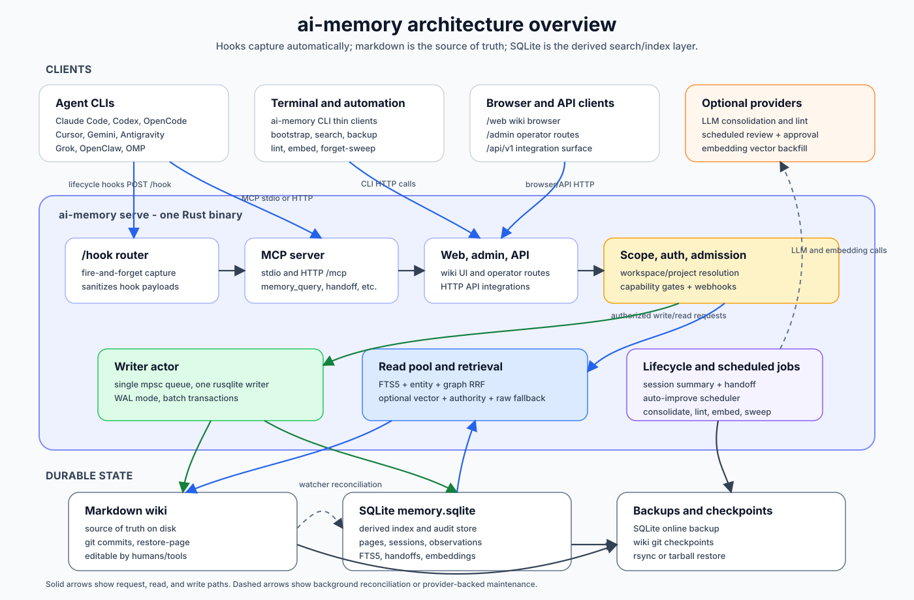

# ai-memory - Architecture

> One canonical doc for "what is this thing and how is it shaped".
> Long-form research lives next to this file under [`docs/`](.); this
> page is the operational summary for someone reading the code.

## Purpose

ai-memory is a single Rust binary that gives the coding agents in the
[README Support Matrix](../README.md#support-matrix), plus other MCP-capable
clients, long-term memory shared across CLIs.
Quit one mid-task; open another in the same directory; continue. No
manual `write_note` ceremony, no copy-pasting summaries between
sessions.

The artifact you accrete is a **Karpathy-style LLM wiki**: a
git-versioned tree of markdown pages on disk that gets *compiled* over
time, appended-to. Pages are versioned in place via
supersession, semantic concepts compound, episodic logs decay. A
companion SQLite index gives FTS5 + lexical entity + link-neighbor retrieval,
with optional vectors; the markdown stays the source of truth.

## Data flow



Solid arrows are request, read, and write paths. Dashed arrows are
background reconciliation or provider-backed maintenance. The core invariant is
unchanged: the markdown wiki is the source of truth, and SQLite is the derived
index for search, sessions, observations, handoffs, audit, embeddings, and the
optional managed-workstream continuity ledger.
Auto-improvement sits on the provider-backed maintenance side: the server
schedules reviews for newly completed sessions in every project, records
validated proposals in the pending-writes audit trail, and auto-approves them
through the normal wiki write path by default. Scheduler ticks are
non-overlapping; long all-project review passes delay the next tick instead of
starting another copy. Scheduling and approval are separate. Admins can set
`[auto_improve.scheduler] enabled = false` to stop background review, or
`[auto_improve] require_approval = true` to leave scheduled and manual proposals
pending for review. Operators can additionally set `[auto_improve.eval]` to run
a project-supplied executable gate for selected proposal prefixes after LLM
validation and before staging/approval; it is disabled by default and never runs
from hook paths.

**Steady-state loop:**

1. Agent CLI emits a lifecycle hook (SessionStart, UserPromptSubmit,
   PostToolUse, …). Shell-script hooks `curl` event JSON to `POST /hook`
   with a short timeout. Native `ai-memory hook --event ...` commands spool
   events locally with a stable per-entry idempotency key, do a short bounded
   cleanup at session start, and hand
   session-end delivery to a detached lock-aware `hook-drain` helper;
   high-latency operators can raise the drain/handoff/background caps with
   minute-based env vars.
   Agent hot paths never block on the network; saturated servers return HTTP
   429 instead of queueing unbounded work.
   For supported native commands and generated OpenCode/OMP/Pi/OpenClaw
   integrations, the nearest-marker capture policy runs first: a dropped
   recognized file-tool event never enters spool, queue, transport, logs, or
   storage. See [Capture exclusions](marker-file.md#capture-exclusions).
2. Server's hook router sanitises the payload (the only path from
   untrusted text into the store), assigns an [`ObservationKind`], and
   enqueues a `WriteCmd` to the writer actor. For native keyed events, the
   project-scoped key and observation commit together. The key is marked
   complete only after downstream processing: an incomplete replay resumes
   wiki/handoff effects without another observation, while a completed replay
   is acknowledged and skipped. A bounded per-project/key gate serializes an
   overlapping retry with the original processor. Downstream effects remain
   at-least-once until that completion marker, so a process crash during those
   effects may repeat an already applied effect rather than silently lose the
   rest. For an interrupted already-ended SessionEnd, the replay converges the
   wiki commit, durable provider job, and pending key without appending another
   observation. `log.md` gets an appended
   `## [YYYY-MM-DDTHH:MM:SSZ] <event> | <title>` line.
3. On true `SessionEnd` events, the server synthesises a
   `sessions/<id>.md` summary page (rule-based, no LLM) and opens a
   `Handoff` row for the next agent. One SQLite transaction inserts that
   automatic handoff, stamps the session ended, and records the covered
   observation count, so recovery never sees only half of those DB effects. A
   later SessionEnd re-runs the path only when that generation advances, so
   resumed sessions are captured while duplicate delivery and clock skew
   converge. Existing ended sessions are baselined at migration instead of
   becoming historical catch-up work. Auto-commits the wiki. Clients
   without a reliable true session-end hook need an explicit ending action:
   `ai-memory finalize-session --agent antigravity-cli` for Antigravity CLI
   (Codex has a native `SessionEnd` since CLI 0.145.0; `finalize-session
   --agent codex` is only the fallback on older Codex).
   The command selects the latest matching open session and enters the same
   canonical SessionEnd path as a native hook. Generated session-page
   frontmatter records `session_id` plus the immutable `sessions.agent_kind`
   as `agent`; it describes the page's harness origin, not the later writer.
   Manual page writes do not receive inferred agent metadata.
4. When `AI_MEMORY_LLM_PROVIDER` is set, `memory_consolidate` rewrites
   that summary into a richer durable page or fans out into a
   multi-page batch under `concepts/`, `decisions/`, `gotchas/`. Consolidation
   prompts preserve the source material's dominant natural language and ask
   the model to connect related pages with path-based wikilinks.
5. When an LLM provider is configured, the auto-improvement scheduler reviews
   newly completed sessions across all projects outside hook latency. It records validated
   `concepts/`, `decisions/`, `gotchas/`, `procedures/`, and `_rules/` proposals
   in the pending-writes audit trail, then approves them through the wiki
   mutation path by default. The scheduler initializes a per-project first-run
   watermark so historical sessions are not processed automatically on upgrade,
   then records per-session claims before LLM work so failed scheduled reviews do
   not retry forever. Explicit CLI/admin/MCP auto-improve calls use the same
   pipeline for targeted reruns or catch-up. With `[auto_improve]
   require_approval = true`, scheduled and manual proposals remain pending until
   explicit pending-writes approval. If `[auto_improve.eval] enabled = true`,
   targeted proposals (default `_rules/` and `procedures/`) must pass the
   configured executable JSON contract before they are staged; failures become
   rejected candidates/rejection-buffer entries rather than wiki writes.
   Every LLM prompt treats repository text, observations, wiki pages, and prior
   proposals as untrusted data rather than instructions. The same explicit
   trust boundary and delimiters precede automatically injected handoffs,
   project briefs, and managed-workstream packets; current instructions and
   checkout state remain authoritative.
6. `memory_query` answers via FTS5 + entity-match + link-neighbour RRF; when an
   embedder is configured, vector cosine over `page_embeddings` joins the same
   RRF. The entity index is derived from the canonical frontmatter `entities`
   list, and an empty index contributes no candidates or score. Before final
   truncation, a bounded authority multiplier adjusts relevance using canonical
   page kind, tier, `pinned`, and explicit positive/negative frontmatter tags.
   It favors maintained rules, decisions, procedures, and gotchas in close
   contests while keeping episodic, historical, lint, and test evidence
   searchable. No query-intent regex or hard exclusion participates. An
   optional `AI_MEMORY_RERANKER=llm` pass sends a bounded query plus up to 30
   bounded titles/snippets to the configured provider after project/scope
   fusion; it is limited to one call per query and four calls in flight, and any
   invalid, failed, timed-out, or saturated attempt preserves the local order.
   Global and supplemental global-preference results do not take this path. If
   compiled wiki pages miss entirely in default, explicit project, or explicit
   `scopes` mode, bounded raw observation FTS returns fallback `raw_hits`;
   `global=true` searches compiled wiki pages across projects only. Page hits
   bump `access_count` + `last_accessed_at` - the M8 reinforcement term, which
   `memory_feedback` complements with explicit per-page salience. Identified
   operators also add one `page_access` row per page; an opt-in
   `[decay] breadth_weight` can reward pages reinforced by several distinct
   operators. That bump is throttled to at most once per page per minute, so a
   burst of overlapping searches does not flood the writer actor with
   redundant reinforcement writes. The same reinforcement fires from every
   read path that surfaces a page, not just search: `memory_read_page` (and its
   `include_related` walk, which reinforces the walked neighbours too) and
   `memory_explore` (the pages it surfaces) bump the same counters through the
   same throttled, FTS-exempt path, so a page a human opens directly or the
   graph surfaces resists decay like a query hit (design-memory-aging.md C1).
7. The forget sweep runs on demand and on the server's `[maintenance]`
   schedule: pages past their frontmatter `expires_at:` TTL are
   hard-deleted through the wiki layer (file + rows, pin or not);
   pages with `retention < cold_threshold` are evicted through the wiki layer,
   which removes the authoritative file and leaves a decay tombstone;
   tombstones older than `hard_delete_after_days` are purged with their full
   version ancestry only within that sweep's resolved workspace/project,
   together with entity-index rows orphaned by the purge. A newer page recreated
   at the same path is preserved. Semantic / pinned / freshly-touched pages
   survive. A fourth pass, disabled unless `[decay] observation_retention_days`
   is positive, then deletes raw `observations` older than that age — but only
   for sessions already consolidated into a summary page that is still live, so
   raw capture is never removed while it is the last copy of that session's
   work. It runs last so this run's own evictions and hard-deletes already
   exclude their sessions, deletes in `observation_prune_batch` transactions so
   a multi-million row prune cannot hold the write lock, and repairs
   `sessions.ended_observation_count` downward in the same transaction. The
   prune is irreversible in a specific sense: observations are the input to
   consolidation, so a pruned session can never be re-consolidated — not with
   a better model, a better prompt, or a fixed consolidator bug — and its
   summary page becomes the only surviving account of that session. Freed
   SQLite pages are reused, not returned to the OS: the `.db` file does not
   shrink, the backup tarball does.
   Scheduled sweep, rule-based lint, and opt-in embedding backfill ticks
   enumerate every existing workspace/project scope before doing per-project
   work, matching the auto-improvement scheduler's store-wide scope model. A
   separate daily cleanup removes week-old project rows only when they contain
   no pages, sessions, observations, handoffs, managed workstreams, or
   auto-improvement data; managed continuity history therefore keeps its
   project scope alive even when no lifecycle-hook session has been captured.
8. Backups: `ai-memory backup --to <tarball>` uses SQLite's online
   backup API so the source stays writable; `ai-memory restore`
   reverses. Or: `git push` the wiki dir + `rsync` the data dir.

**Optional managed-workstream loop:** `ai-memory run` opens a lease for the
current repository/worktree workstream, resolves an explicit harness or the
newest usable local/linked harness, creates or resumes that harness's native
session, and marks lifecycle calls with an invocation-scoped run id.
SessionStart injects an unseen bounded event range; Crush receives it through a
temporary supported global-context path because it lacks SessionStart. The host
imports the native transcript tail and a Git checkpoint when the child exits.
Every injected packet starts with a versioned origin marker. The Claude
transcript normalizer excludes a marked packet if Claude persists and reads it
back, preventing delivered history from recursively re-entering the ledger.
An explicitly pending handoff is delivered before the managed event range;
their single-use delivery claims share one writer transaction after the
complete startup response has been assembled. Manual handoffs take precedence;
otherwise the newest cwd-eligible automatic handoff is delivered, and that
same transaction expires older eligible automatic handoffs while preserving
manual and sibling-directory work. Insertion also expires prior open automatic
handoffs from the exact cwd, bounding repeated SessionEnds before any receiver
starts.
ai-memory opens native stores read-only. Raw sanitized JSONL segments are
immutable, while SQLite supplies monotonic sequences, FTS, native
source/delivery cursors, and idempotent retry state. A full-ledger
`workstream-search` path complements
the bounded startup packet. An interactive empty workstream may adopt a
checkout-matching native session once. Eligibility comes from authoritative
ledger/session state: after any harness establishes the workstream, a newly
joining harness starts fresh and receives portable history instead of adopting
unrelated old native history. Handled launcher failures cancel their lease;
normal reopen retries brief finalization conflicts, while an unclean process
death remains bounded by the renewable lease expiry. See [Managed cross-harness
workstreams](managed-workstreams.md).

## Hook event vocabulary

The core observation vocabulary is a closed set of agent lifecycle
events. Hook bridges may accept client-specific aliases, but storage
normalises them to exactly one of these `ObservationKind` values:

| Stored kind | Semantics |
|---|---|
| `session-start` | Agent session began; cwd/model/session identity captured. |
| `user-prompt` | User submitted prompt text to the agent. |
| `pre-tool-use` | Agent is about to call a tool. |
| `post-tool-use` | Agent finished a tool call. |
| `pre-compact` | Agent is about to compact or compress its context. |
| `post-compaction` | Agent compacted context and supplied a post-facto summary or checkpoint. |
| `notification` | Agent emitted a notification-style event. |
| `stop` | Agent finished an interactive turn or stopped naturally. |
| `session-end` | Agent session ended; summary/handoff path may run. |
| `other` | Unknown or unsupported hook event. |

Antigravity CLI has no native SessionStart event. Its `PreInvocation` hook
fires before every model call, so the bridge maps only the documented
`invocationNum = 0` payload to `session-start`; later invocations are ignored
before spool or network side effects.

Unknown events do **not** expand the enum and, by default, leave no
source-event metadata in storage; they collapse to `other`. Third-party
integrations that need their own vocabulary can opt in by sending
`extension=<namespace>` on `/hook`. With a valid extension namespace,
ai-memory stores an explicit `source_event=<name>` when provided, or the
unknown `event` string when `source_event` is omitted. The stored pair is
nullable observation metadata; `kind` stays canonical. This is an
extension seam, not a runtime plugin system: external processors must use
the existing HTTP/MCP APIs and cannot bypass the sanitizer, hook
backpressure, or single-writer SQLite actor.

An external lifecycle producer can set `AI_MEMORY_CAPTURE_OWNER` on the harness
process to suppress its installed native capture while retaining supported
handoff/briefing delivery and MCP. The producer uses `extension`/`source_event`
for provenance and stable, namespaced `ingest_key` values for retries. See the
[external capture contract](external-lifecycle.md) for batching, identity and
the limits of this cooperative process-scoped mode.

Lifecycle bodies have content limits independent of the 10 MiB HTTP request
limit. User prompts and post-compaction summaries are capped UTF-8-safely at
16 KiB; notification and tool excerpts are capped at 2 KB. Native
`ai-memory hook` commands apply the event-specific cap before local spooling
and transport, and the server repeats it when parsing every request so direct
and older clients cannot bypass it. The typed sanitizer boundary then applies a
16 KiB backstop to every durable observation body after redaction. The
separately gated Claude Code assistant/Stop excerpt remains capped at 2 KB.

An optional RFC 3339 `occurred_at` on the hook body lets a client supply the
event's own original time — currently only `ai-memory backfill`, replaying a
transcript's per-event timestamps, so imported sessions/observations are
stamped with when they actually happened instead of import time. It is read
from the top level of the body only (unlike the nested `payload`/`event`/
`properties`/`info`/`path` search other hook fields use), so a real harness
payload that happens to carry an `occurred_at` key somewhere in its own
structure is never mistaken for this field. It is numeric metadata, not text,
so it never goes through the sanitizer (outside invariant #6's boundary); it
is still client-controlled input over `/hook`, so
`HookEnvelope::occurred_at_micros` bounds it (must be > 0 and no more than
five minutes ahead of server time) before trusting it. Anything else —
missing, unparsable, or out of bounds — resolves to `None`, which the store
treats as "now", never an error, keeping hooks fire-and-forget (invariant #5).
A backfilled session's `ended_at` can therefore land well in the past, which
can push it below the auto-improve watermark and the experience-pass anchor
(both keyed on `ended_at`), and a retention window measured from an
observation's own time can make an old backfilled observation immediately
prunable rather than only after it ages in place.

## Storage architecture

**Two layers, one source of truth.**

* `<data_dir>/wiki/` - markdown source of truth. Owned by a `git2`
  repo so every consolidation pass + every session-end produces a
  durable commit. Editable by hand in Obsidian / vim - the watcher
  reconciles outside edits.
* `<data_dir>/db/memory.sqlite` - derived index. WAL mode. One
  writer actor owns the writer `Connection`; reads go through a
  cloneable read-only pool.
* `<data_dir>/raw/` - immutable sanitized managed-workstream JSONL segments.
  Legacy raw fallback recall searches the durable `observations` table via
  FTS5; lifecycle HookEnvelope JSON is not a complete transcript archive.
* `<data_dir>/logs/` - rolling daily `tracing` output.
* `<data_dir>/models/` - reserved for bundled embedding models
  (M9.5+, when local `ort` lands).
* `<data_dir>/client-projects.json` - private, client-local checkout links for
  `ai-memory show`, keyed by credential-free server identity plus workspace and
  project. It is not part of the SQLite/wiki source of truth, and no server API
  exposes host paths.

**Schema (current head):**

| Table | What |
|---|---|
| `workspaces`, `projects` | Top of the 3-tuple identity coordinate. `projects.identity` / `identity_source` (V70, #708) hold the repository identity a project routes by — an explicit marker `identity` or a normalised git remote, resolved client-side — unique per workspace when set; empty until a capture claims the project. See `docs/marker-file.md#repository-identity`. `projects.access_mode` (V68; `open` default / `restricted`) decides whether any authenticated user or only root, the creator (`projects.created_by`, V69) and grant holders (`project_grants`, V68) reach it, decided by `ai_memory_store::authorize_project` — `docs/users.md#per-project-access`. |
| `pages` | Versioned wiki pages with `is_latest` + `supersedes` chain. M8 columns: `last_accessed_at`, `access_count`, and decay-only tombstone marker `superseded_at`. M9 cols: `embedding_provider`, `embedding_model`, `embedding_dim`. V36: `expires_at` (frontmatter TTL). V37: `salience` (NULL = `salience_default`; derived from `page_feedback`). |
| `pages_fts` | FTS5 virtual table over `(title, body)`, auto-synced by triggers. |
| `sessions`, `observations` | Sanitized, bounded lifecycle-hook projections. `sessions.ended_observation_count` is the stable generation watermark for resumed-session re-end eligibility; wall clocks are not used for that decision. They are an operational audit trail, not a complete native transcript. |
| `session_consolidation_jobs` | Durable, observation-generation-idempotent queue for the *automatic* SessionEnd LLM consolidation worker. One bounded server worker leases jobs, retries provider failures with backoff, and recovers expired leases after restart. A manual `memory_consolidate` writes its page out-of-band and then reconciles this table (flipping a `failed`/`pending`/`superseded` row for the session to `completed`, never touching a live `running` lease), so the operator does not see a `failed` job for a session that is in fact consolidated. |
| `observations_fts` | FTS5 virtual table over raw observation `(title, body)`, used only as bounded fallback. |
| `workstreams`, `managed_runs`, `workstream_native_sessions` | Optional lease state plus per-harness native source and delivery cursors for `ai-memory run`. |
| `workstream_events`, `workstream_events_fts` | Append-only normalized visible transcript events and full-text search; immutable sanitized source batches also live under `raw/workstreams/`. |
| `links` | Wikilink / markdown cross-references. `to_page_id` (a global PageId) is nullable for unresolved forward links. `to_workspace` / `to_project` carry a cross-project scope (NULL = the source page's own project). |
| `handoffs` | Typed cross-agent handoff records (open / accepted / expired). |
| `page_embeddings` | Optional vector rows for latest pages, with `(provider, model, dim)` denormalised so hybrid search can ignore stale vectors after an embedding config change and report missing-embedding diagnostics. |
| `page_feedback` | Append-only `memory_feedback` signals (`helpful` / `not_helpful` / `stale` / `wrong`) keyed by page *version*, with an optional sanitized reason and `salience_after`. Source of truth for the derived `pages.salience`; the lint pass reads unresolved stale/wrong rows joined against `is_latest = 1`, so a rewrite retires the finding. |
| `page_access` | One row per latest page and qualified operator identity. Supplies the optional access-breadth retention term without changing the existing shared access counter. |
| `page_evidence` | V63 append-only record of what produced or reaffirmed each page version — consolidation cites the `session` it ran on, written in the page-upsert transaction and cascaded on purge. Feeds a read-time, zero-LLM **belief-strength `confidence`** (`ai_memory_store::belief`, B1 / `docs/design-hindsight-borrowings.md` P2): a bounded `[0.0, 0.95]` function of distinct supporting sessions (breadth, not raw count), recency of the newest sighting, and live `contradicts` count. Exposed as `confidence` + `evidence_count` in `memory_query(explain=true)`, as `evidence_rows` in `memory_status`, and used to order the opt-in `settled_first` briefing — all **ranking-inert**. It folds into `PageAuthority` only behind `[retrieval] belief_authority_weight` (**default `0.0`/OFF, R2-gated**), as one bounded factor inside the `[0.55, 1.50]` clamp; a supersession always wins regardless of evidence (a superseded version is never boosted). |
| `agent_messages` | V64 cross-project message inbox/queue (`docs/agent-messaging.md`). Directed, claim-once mail from a sender coordinate to a recipient coordinate; `pending`→`claimed` (popped exactly once, the handoff compare-and-set) or `pending`→`cancelled` (sender retracts). The one table that crosses per-project isolation, so reads are keyed by the recipient coordinate (inbox) or sender coordinate (outbox); `from_owner_user`/`claimed_by_user` are attribution only, never a read filter. Recipient inbox depth is capped. `ON DELETE CASCADE` on both coordinate pairs. |
| `pages.compacted_at` | V65 nullable A2 tier-down marker (`docs/design-memory-aging.md` §A2). Set when the forget-sweep extractively compacts a cold episodic page (opt-in `[decay] compact_cold_episodic`) instead of evicting it; derived at the single page-upsert choke point from a `compacted: true` frontmatter mirror, so the marker and compacted body land in one transaction. Additive `ADD COLUMN`, no backfill — populated lazily by the sweep. The sweep and curator skip a marked page so it is never re-compacted, re-evicted, or re-reported as cold. Reversible: the full pre-compaction body stays in git + the supersession chain. |
| `client_activity` | Server-wide MCP tool-call counters split into reads/writes and bucketed by UTC day. The MCP request choke point flushes buffered calls on a one-minute background interval; failed batches retry from bounded memory. Each day stores at most 128 sanitized client labels plus `other`, so an untrusted `clientInfo.name` cannot create traffic-proportional rows. |
| `auto_improve_proposals` | Staged learning and maintenance edits with immutable target snapshots and append-only decision events. Pending-target uniqueness is scoped by the qualified staging identity; unattributed proposals retain the historical shared bucket. |
| `entities`, `entity_page_links` | V38 noun index derived from canonical frontmatter. Names are normalized and unique per project; links target immutable page versions while retrieval filters to the latest version. Scope-pairing triggers prevent cross-project links. Powers the fourth RRF retrieval stream. |
| `audit_log` | Every mutation, addressable by `at DESC`. |

**Memory tiers (M8 policy):**

| Tier | Lifetime | Decay |
|---|---|---|
| Working | Current session only | Hard-drop on session end (kept in `observations` for forensics) |
| Episodic | 30d hot → 180d cold → evict (or tier-down, opt-in A2) | `salience · exp(−λΔt) + σ · log(1+access_count) · exp(−μ · days_since_access) · (1 + breadth_weight · ln(1 + max(distinct_actors−1, 0)))` |
| Semantic | Indefinite | None - only supersedeable via M7 LLM rewrite |
| Procedural | Indefinite | Frequency-decay if not re-observed |

`λ` is the scalar `[decay] lambda` by default, but can be set per tier via
`[decay.half_life_days]` (a half-life in days per tier, converted to
`λ = ln(2)/days`); an unset tier uses the scalar, so the default reproduces
today's single-λ scores exactly.

**Extractive tier-down (A2, opt-in).** With `[decay] compact_cold_episodic =
true`, the sweep runs a compaction pass *before* the decay-eviction pass: a cold
episodic page that is not already compacted is rewritten through the wiki layer
to keep its L0 `abstract:`, an L1 first-paragraph summary, and an L2 regex-mined
keep-token set (paths, URLs, code spans, error codes, identifiers), dropping the
prose — instead of being tombstoned. The rewrite supersedes the prior version,
so the full body stays reachable (git + supersession chain; `restore-page`
recovers it). The `V65` `pages.compacted_at` marker makes a compacted page
terminal for the decay pass (never re-compacted, never re-evicted, never
re-reported as cold). Zero-LLM, off by default; the R2 recall no-regression
proof gates any future default-on.

**LLM "dream" pass (B2/B3/B4, opt-in LLM, OFF by default, R2-gated before
default-on).** Where A3 collapses near-duplicate cold clusters *extractively*
(zero-LLM, keep-token union), the dream pass
(`ai-memory-consolidate::dream::run_dream_pass`) hands each cold cluster to the
configured provider to be rewritten into ONE coherent page — the prose-coherent
merge extraction cannot do. It reuses A3's clustering math (`adaptive_eps` /
`dbscan`) over the *same* bounded cold set the forget sweep materialises
(`sweep::materialize_cold_set`, invariant #2). It runs only when `[dream]
enabled` is set AND a provider AND an embedder are configured; a provider-less
store keeps the zero-LLM A3 path (invariant #13). It **never deletes a source**
(invariant #16): the highest-retention member is rewritten and every merged-away
member is *superseded* with a merge-note stub, so the full pre-merge body stays
reachable (git + supersession chain; `restore-page` recovers it), and
`page_evidence` (`reconsolidation` + `b2_dream:<id>`) records which members fed
each merge (the hallucinated-merge guard). The rewrite routes through the gated
apply path — `preflight_admission(Consolidate)` before the LLM, then
`Wiki::apply_batch` (single-writer actor, invariant #2) — with **`dry_run`
first** (returns the plan, calls neither the LLM nor the writer) and
**JSON-schema structured output only** (invariant #7). Scheduling (B3, in
`serve.rs`) starts a run only after `[dream] idle_window_secs` of no client
activity (read from the tool router's shared `ActivityClock`) and **cancels it
the moment activity resumes** — a cheap `DreamCancel` flag polled between
clusters — bounded to `max_clusters_per_run` clusters per run (invariant #5).
Work is ordered **surprisal-first** (B4): the most-novel clusters, farthest in
embedding space from the nearest existing (non-cold) page, first. Every run
returns an observable `DreamReport` so a bad run is never silent. No new
migration (reuses `page_evidence` + supersession); no new MCP tool.

Pinned pages (`pinned: true` in frontmatter) are exempt from all
decay paths. Pages under `_slots/` are pinned automatically and surfaced
in briefing/explore snapshots as tiny editable memory slots. Slot pages
may declare a write regime with `slot_kind: state` or
`slot_kind: invariant`; omitted means `state` for backwards
compatibility. Use `state` for mutable working context such as current
focus and pending items. Use `invariant` for high-resistance project
context, identity, rules, or user preferences; consolidation should not
rewrite an existing invariant slot unless new observations directly
contradict specific existing content.

Shared servers may opt into `[slots] per_user = true`. Engine and MCP slot
writes then use a bounded namespace derived from the authenticated
`IdentityKey`; session briefs and consolidation prompts include shared slots
plus the caller's namespace. Existing unnamespaced slots stay shared and the
default remains off. Exact wiki reads and searches are deliberately unchanged:
this boundary limits prompt injection, not page access.

## Cross-project links

Pages normally link within their own project (`[[decisions/0001.md]]`, or a
`label` pointing to `../gotchas/x.md`). A wikilink can also name another project
so that dependencies between projects become explicit edges in the graph:

* `[[project:path.md]]` — a sibling project in the same workspace.
* `[[workspace/project:path.md]]` — a project in another workspace.

The parser (`ai-memory-wiki::extract_links`) yields a `LinkTarget
{ workspace, project, path }`; the store resolves it against the named
project's latest page and records the scope in `links.to_workspace` /
`links.to_project` (NULL = the source's own project, the common case).
Resolution is deferred-safe: a link to a page that does not exist yet
stays `to_page_id = NULL` and is repointed by
`refresh_incoming_links_for_path` when that page later lands — across
projects, not only within one.

Because `to_page_id` is a global id and `ReaderPool::page_links` joins by
id without a project filter, a resolved cross-project link surfaces as a
backlink on its target for free; `RelatedPage` carries the source's
`workspace` / `project` so the dependency is labelled and navigable. This
is what turns the per-project wikis into one dependency graph (see also
the `memory_lint` dangling-ref check, the briefing dependents counts, and
the `/api/v1/graph` endpoint).

## Crate layout

```
crates/
├── ai-memory-core/        domain types, errors, ids. NO IO.
├── ai-memory-store/       SQLite + writer actor + reader pool + decay math.
├── ai-memory-wiki/        atomic markdown writes, file watcher, git.
├── ai-memory-mcp/         rmcp transport + tool router.
├── ai-memory-hooks/       payload schemas, sanitiser, /hook ingress.
├── ai-memory-llm/         provider auth boundary + LlmProvider / Embedder traits.
├── ai-memory-consolidate/ Karpathy ingest / lint / sweep / auto-improve pipeline.
├── ai-memory-workstream/  read-only native transcript + launch adapters.
└── ai-memory-cli/         `ai-memory` binary entry point + thin HTTP subcommands.
```

Each crate has a single responsibility and exposes a typed API. No
circular deps. Inter-crate boundaries enforce the cross-cutting
invariants below.

## MCP tool surface (23 tools)

| Tool | Hint | Purpose |
|---|---|---|
| `memory_query` | read-only | FTS5 + entity-match + graph RRF + optional vector RRF search, followed by bounded kind/tier/pinned/tag authority adjustment and raw fallback. Bumps access counters for page hits. Defaults to the current project; single-project calls (project implicit or named with `workspace`+`project`) also union the reserved `_global` preferences scope as `global_scope_hits`, and only an explicit multi-`scopes` set opts out (#930); `scopes` searches named sibling projects; `global=true` searches every project at once (each hit annotated with its workspace + project). With `AI_MEMORY_RERANKER=llm`, project/scopes candidate pools are fused before at most one final LLM relevance pass; query/title/snippet data is bounded and JSON-encoded, and any timeout, provider error, invalid/incomplete score set, or four-call concurrency saturation preserves the adjusted order. The distinct `global=true` FTS-only ranker and supplemental global-preference hits are not reranked. `explain=true` attaches per-hit `score_details` (per-stream ranks, matched entities, raw FTS/cosine/entity inverse-frequency scores, RRF contributions, graph provenance including the typed edge kind (`causes`/`fixes`/`contradicts`) a neighbour was reached by, the page's evidence count, authority multiplier, and optional rerank score) to project/scopes hits plus a top-level `streams_active` list. The global FTS-only ranker reports its active stream without per-hit details. `include_expired=true` also returns TTL-expired pages. `include_superseded=true` also returns superseded (non-latest) page versions across the FTS/entity/vector/graph streams, each hit labelled `superseded: true` (the current version is never marked); default-off is byte-identical to the latest-only behaviour, and `global=true` / `as_of` are unaffected. `pin_first=true` prepends the project's bounded pinned latest pages (`ReaderPool::list_pinned_pages`, cap 10) ahead of the fused hits, deduped by page id (a pinned page that also matches appears once, marked `pinned: true`) and re-truncated to the requested limit; it applies to single-project searches (default or `workspace`+`project`), is ignored on `scopes`/`global`/`as_of`, and default-off is byte-identical. `answer=true` (opt-in, off by default) additionally synthesizes a cited natural-language answer over the top hits via the configured LLM provider (`complete_structured`, JSON-schema `{ answer, citations }`), attached as `answer: { text, citations }`; with no provider configured it returns the hits plus an `answer_unavailable` note instead of erroring, and with `answer` unset/`false` no provider is accessed and the response is byte-identical (invariant #13). It applies to the normal single-project/`scopes` path; `global`/`as_of` ignore it. Answer quality is not yet eval-validated. An optional `reasoning` tier (`minimal` (default) / `low` / `medium` / `high` / `max`) tunes the synthesis effort: `ChatRequest` carries no per-request reasoning field (the provider-level `reasoning_effort` is fixed at construction from config), so the tier maps to a per-tier max-token budget scaled off the path's base (answer base 2 000; `minimal` = 1x = byte-identical, `low` 1.5x, `medium` 2x, `high` 3x, `max` 4x). The tier is inert unless the `answer` LLM path runs (invariant #13); an unknown value is rejected by the schema (invariant #7). |
| `memory_recent` | read-only | Most-recently-updated `is_latest=1` pages. |
| `memory_read_page` | read-only | Fetch the FULL body of a single wiki page by `path` or by top FTS5 hit for a `query`; optional `workspace` + `project` targets a named sibling workspace/project. Use when an agent needs more than the 24-word snippets from `memory_query`. `include_related=true` also walks the link graph outward from the page (bounded BFS reusing the `page_links` primitive per node: default 1 hop, hard cap 3, global visited set for dedup/cycle-safety, total-node cap 50, cross-project aware) and returns a `related` array of reachable pages, each labelled with its `depth` (hop distance) and `direction` (`link`/`backlink`); default-off is byte-identical (no `related` field). |
| `memory_read_session_observations` | read-only | Page through ONE session's raw hook observations (`ObservationRecord` with full sanitized body, capped per row by `body_max_chars`), restricted to the rows that landed in the resolved scope and to sessions the caller may see; `total` and `elided_other_scope` report the in-scope count and the rows the session left in another project. `session_id` omitted reads the latest completed visible session. |
| `memory_status` | read-only | Counts, paths, version, plus the `scope` that answered: `workspace`, `project`, and `resolved_by` (`explicit`, `session`, `shared_slot`, `startup_seed`, `default`, `default_after_mismatch`). Unscoped reads resolved by `startup_seed` or `default_after_mismatch` also log a server warning. |
| `memory_briefing` | read-only | Structured counts/activity/rules/slots/recent snapshot. Project-scoped snapshots also carry a bounded `pinned` list (up to 10) of the project's pinned latest pages (`pinned = 1`, newest first) as standing SessionStart hot-context — distinct from `slots`, which is keyed by the `_slots/` path prefix; empty and omitted from JSON when the project has no pins, so the default shape is unchanged. Opt-in `settled_first: true` leads with up to 8 of the project's highest-standing `rule`/`decision` pages, ordered by evidence count then recency; off by default. |
| `memory_explore` | read-only | LLM prose digest over the briefing snapshot, degrading to JSON without a provider. An optional `reasoning` tier (`minimal` (default) / `low` / `medium` / `high` / `max`) scales the digest's max-token budget off its base (16 000; same 1x/1.5x/2x/3x/4x mapping as `memory_query`); inert on the no-provider briefing-only path, and `minimal` is byte-identical. |
| `memory_handoff_begin` | destructive | Open an owner-scoped handoff for the next agent; `shared=true` deliberately publishes it to the project. Optional `workspace` + `project` targets a named sibling workspace/project. |
| `memory_handoff_list` | read-only | List open own/shared handoffs with inspectable body and identity fields; does not claim or expire. Root-only `any_owner=true` recovers across operators. Optional `workspace` + `project` targets a named sibling workspace/project. |
| `memory_handoff_accept` | destructive | Fetch + ack an open own/shared handoff. Pass `handoff_id` from `memory_handoff_list` to claim that exact row; omitting it still claims the latest eligible open handoff (automatic handoffs are cwd-matched). Root-only `any_owner=true` recovers across operators. Optional `workspace` + `project` targets a named sibling workspace/project. Returns `handoff` plus `status`: `claimed` (this call won it), `consumed_by_hook` (the calling session's own SessionStart claimed it, so it is already in context; needs the session id the hook claimed under, i.e. a session-aware client), or `none_pending`. |
| `memory_handoff_cancel` | destructive | Mark an exact visible open handoff id expired when it was created by mistake; root-only `any_owner=true` recovers across operators. |
| `memory_message_send` | destructive | Send a directed cross-project message into another project's inbox (V64). Requires `to_workspace` + `to_project`; the recipient must already exist (fail-closed, never created). Body is secret-scrubbed and size-capped. The one tool that crosses project isolation on purpose. |
| `memory_message_list` | read-only | List pending mail for this project — `box="inbox"` (poppable, default) or `box="outbox"` (cancellable). Bodies are untrusted cross-project input. |
| `memory_message_pop` | destructive | Claim ONE inbox message exactly once (oldest, or a specific `message_id`); returns it fenced as untrusted input with sender provenance, or `null` when empty. |
| `memory_message_cancel` | destructive | Retract a pending sent message by `message_id`, or clear the whole outbox when omitted. Scoped to the sender project. |

`memory_handoff_list` is the inspect-without-claim path for clients that cannot inject SessionStart stdout. `memory_handoff_cancel` needs an exact id. `ai-memory handoffs` lists the open
handoffs for a project, oldest first, with their ids — read-only, and
content-free (identity, provenance and age, never the summary body). Automatic
expiry deliberately spares manual and sibling-directory handoffs, so a
long-lived entry appearing there is that policy working rather than a fault.

| `memory_consolidate` | destructive | LLM-driven page rewrite. `multi_page=true` for atomic fan-out; an update whose path names an existing pinned page is skipped (`_slots/` excepted). Omitting `session_id` (or sending a blank one) consolidates the latest completed session in the resolved project; the same omission on a project with none fails as `no completed session in <scope>`. Consolidation prompts append the target project's active reserved `_prompts/consolidation.md` body as sanitized, 2,000-character-capped, JSON-encoded, untrusted advisory preferences; TTL-expired pages are ignored and a per-call `instructions` argument overrides the page for one call. Both system prompts keep schema, evidence, disclosure, tool-use, and output rules authoritative. |
| `memory_feedback` | write | Record a quality signal for one page by exact `path`: `helpful`/`not_helpful` step `pages.salience` for sweep-eligible episodic pages, while `stale`/`wrong` floor salience and surface any current page as a `feedback_flagged` lint finding. Never deletes; the path resolves to the current version in the transaction, so a later rewrite clears it. Retrieved content never authorizes feedback by itself. |
| `memory_auto_improve` | write | Manually review a completed session and apply or stage validated wiki edits through the auto-improvement approval path. Without a session ID, selects the newest completed session with no persisted auto-improvement run so repeated calls advance through preflight skips; an explicit ID remains rerunnable. The server also schedules review for new sessions; `[auto_improve] require_approval = true` leaves proposals pending for manual review. |
| `memory_write_page` | destructive | Write durable wiki knowledge when the user explicitly asks to remember/annotate it. `scope: "global"` writes into the reserved `_global` preferences scope; optional `expires_at` sets an RFC3339 or date-only TTL. |
| `memory_delete_page` | destructive | Delete a single page by exact `path`. Fires the admission chain (op=delete); idempotent. |
| `memory_forget_sweep` | destructive | Retention pass: evict cold pages through the wiki layer, purge aged tombstone ancestry, and hard-delete TTL-expired pages. `dry_run=true` for preview. |
| `memory_lint` | destructive | Rule-based + LLM contradiction findings → `wiki/_lint/`. Also runs a **zero-LLM contradiction detector** (design-memory-aging.md A5): cold semantic/procedural pages whose already-stored embeddings sit in the `contradiction_band_min`–`contradiction_band_max` cosine-similarity band (default 0.4–0.75; "same topic, not a near-duplicate" — at/above the max is A3 dedup, below the min unrelated) get an advisory `contradiction` finding with newer-wins timestamp advice. Bounded (one embeddings load over the capped cold set, capped findings, deterministic); a clean no-op with no embedder configured; advisory-only — never deletes/edits/supersedes a page and persists no edge (invariants #13, #16, #2), so no migration. On a single-language or single-domain store, background similarity between unrelated pages already sits well above the default floor, so the band measures domain proximity more than conflict and produces noisy findings — raise `contradiction_band_min` (`config.toml` or `AI_MEMORY_CONTRADICTION_BAND_MIN`) for such a store. |
| `memory_install_self_routing` | read-only | Return the canonical slim routing snippet plus managed Agent Skill payloads and target hints for CLAUDE.md / AGENTS.md installs. |

`memory_briefing`, `memory_explore`, `memory_write_page`,
`memory_install_self_routing`, `memory_read_page`,
`memory_read_session_observations`, `memory_delete_page`,
`memory_handoff_cancel`, `memory_auto_improve`, and `memory_feedback`
post-date the original "narrow on purpose" cut (§10 of
`design-decisions.md`): briefing/explore separate the structured vs.
prose halves of "what's going on", `memory_write_page` covers explicit
durable annotations without abusing single-use handoffs,
`memory_install_self_routing` exists for the meta case where the agent
must re-write its own routing rules into a project's `CLAUDE.md` /
`AGENTS.md` and install the companion managed Agent Skills into
`.claude/skills` or `.agents/skills`, `memory_read_page` complements
`memory_query` for the "I need the full page, not a snippet" case
(e.g. opening a decision page end-to-end),
`memory_read_session_observations` opens the raw evidence behind a compiled
page or a raw hit (one session, in scope, paged and body-capped) so an agent
can audit what the hooks actually captured, `memory_auto_improve` exposes a
safe default-on learning review through the same approval/write path as
pending writes, and `memory_delete_page` is the exact-path destructive pair
needed by admission-aware mirrors. `memory_handoff_cancel` is the safety valve
for mistaken handoff creation. `memory_feedback` implements the
"finer-grained reinforcement beyond access counts" P2 item from
`prior-art-implementation-findings.md`: it cannot ride on a read tool
without conflating read and write semantics, and the access counter it
supplements cannot tell "this page answered the question" from "this page
wasted a read". The narrow-surface discipline still holds —
every new tool has to earn its slot — but the count is now 23, not 10.

The managed Agent Skills are a narrow prompt-packaging exception to the
otherwise wiki-centered architecture. They are static `SKILL.md` files that
teach agents when to call ai-memory MCP tools; they are not durable wiki pages,
not auto-improvement output, and not a runtime skill router inside ai-memory.

MCP parameter aliases are intentionally sparse: `memory_query.query` accepts
`q|search`, and limit fields accept `n` / `top_k` where shipped. Project and
cwd parameters use their canonical names.

Claude Code's optional session-aware MCP registration is a transport adapter,
not a second tool implementation. `ai-memory mcp-bridge` serves the upstream
tool catalogue over local stdio, delegates tool calls to the configured HTTP
server through rmcp's client transport, and injects the inherited
`CLAUDE_CODE_SESSION_ID` as `X-Memory-Actor-Session-Id`. The server therefore
keeps the same auth, scope resolver, and tool handlers as direct HTTP clients.
The adapter fails closed without a Claude session id and is installed only by
the explicit `install-mcp --client claude-code --session-aware` option.

## HTTP authentication classes

The process separates four active credential classes from one transitional
browser compatibility path:

| Class | Wire | Authorizes |
|---|---|---|
| Human password | `POST /auth/login` body | Session issuance only |
| Web session | `ai_memory_session` cookie + CSRF | `/auth/me`, `/admin/*`, `/api/v1/*` by `AuthLevel`; never `/mcp` or hooks |
| Recovery | `POST /auth/recovery` body | Root password reset; no session |
| API key | `Authorization: Bearer` (`aim_`, root `AI_MEMORY_AUTH_TOKEN`, or external `amk_`) | Machine APIs; never a web session |
| Deprecated browser compatibility | HTTP Basic root bearer, then HttpOnly `ai_memory_auth` cookie | GET-only browser routes until any human password or completed bootstrap exists; never machine routes |

The deprecated Basic/cookie path stops immediately when human auth becomes
active; restart is not required. `/web` SPA HTML is public static; the builtin
wiki browser and JSON APIs stay behind the route class above.

## CLI subcommand surface

```
init                 status               run
show                 continue             resume
workstreams          rename-workstream    workstream-search
audit-contamination  search               read-page
write-page           delete-page          serve
reset                backup               restore
reindex              install-hooks        hook
install-mcp          commit               checkpoints
restore-page         llm-test             forget-sweep
lint                 curator              auto-improve-report
auto-improve         finalize-session     pending-writes
embed                generate-auth-token  setup-agent
bootstrap            install-instructions install-skills
reorg                purge-project        rename-project
move-project         move-session         uninstall
upgrade              auth                 user
completions          handoffs             purge-session
compact              api-key              export-okf
message              doctor               backfill
project              reclaim-ledger-versions               repair-backfill-timestamps
server
```

Run `ai-memory --help` for the full tree.

`auto-improve-report` is read-only by default; `--stage` creates one pending
telemetry report page for audit/approval without staging learning-memory edits.

`reclaim-ledger-versions` drops the superseded versions of the raw hook event
ledger that the pre-2.1.1 indexer left behind (#660). It is a dry run unless
`--confirm` is passed. A path is only a candidate when its *content* opens
with a hook log entry — the same
`ai_memory_core::log_ledger::body_opens_with_log_ledger` gate the indexer
(#660), the OKF conformance migration (#669) and the bundle export (#748) use
— so a real page named `log-2026-09.md` keeps its whole version chain. Only
`is_latest=0 AND superseded_at IS NULL` rows are eligible, so rows a decay
tombstone owns stay with `forget-sweep`. Derived FTS/entity/vector/link rows
go with the page through the existing `ON DELETE CASCADE`s, and the FTS delete
trigger is stood down for the bulk delete (its DDL is read back from
`sqlite_master` and re-executed) so the cleanup does not re-tokenize tens of
gigabytes of ledger body row by row; `pages_fts` is then rebuilt wholesale.
`--compact` additionally `VACUUM`s to return the bytes, at the cost `compact`
documents.

## Cross-cutting invariants

Carved in M0/M1; every milestone has to respect them. Each comes from
a documented prior-art bug; cite the source when reviewing changes
that touch the relevant area.

1. **One config-read path.** `Config::load()` called once at startup.
   No `std::env::var` outside it.  (agentmemory #456 / #469.)
2. **Single-writer SQLite actor.** All writes go through one `mpsc`
   channel to one dedicated OS thread. (cognee #2717.)
3. **Indexes commit in the same transaction as the data.** No
   background-task-indexing-after-return. (basic-memory #763 / #578.)
4. **Typed 3-tuple identity** (`workspace_id`, `project_id`, path)
   in every domain row from day one. (basic-memory #783 / #834.)
5. **Hooks are fire-and-forget.** Hook scripts hard-timeout at
   ≤200 ms; server returns 202 immediately or 429 when saturated.
   (agentmemory #221 / #143.)
6. **Privacy strip is a typed boundary.** `Sanitized<NewObservation>`
   has no other constructor than `sanitize()`. (design-decisions §14.)
   The opt-in assistant/Stop excerpt (#196) enters through this same
   boundary: the client sanitizes it before it reaches the wire, and the
   server re-scrubs it here with its configured patterns before the write.
7. **JSON-schema structured outputs only.** Native provider JSON
   modes; no XML, no Instructor wrapping. (agentmemory #492 / #539,
   cognee #2840.)
8. **`{provider, model, dim}` denormalised next to every embedding.**
   Warn and ignore stale vectors on mismatch until re-embedding completes.
   (agentmemory #469.)
9. **Live-process check before direct-disk lifecycle ops.** `ai-memory reset`,
   `restore`, `reindex`, and `uninstall --purge-data` consult `sysinfo`; the
   uninstall guard is conditional on `--purge-data`. `backup` is a thin HTTP
   client instead: the server snapshots SQLite with its online backup API while
   the writer remains live. (basic-memory #765.)
10. **Atomic file writes** (tmp + rename + fsync). Watcher ignores
    own writes by filename prefix.
11. **Absolute canonical data dir** default; logged loudly on
    startup. (agentmemory #303.)
12. **No global singletons / `lazy_static` configs.** All deps
    explicit. (cognee #2228.)
13. **Zero-LLM default path.** LLM has opt-in via env. The
    system works without any provider configured.
14. **Provider auth resolves before provider construction.** Native
    provider clients consume typed `ProviderAuth` material; they never
    read env vars directly. Token-backed providers receive explicit
    auth-file paths / env-derived token material through that boundary,
    then own provider-specific refresh and persistence.
15. **Tracing subscribers explicitly filter their own module.**
    No feedback loops. (agentmemory #519.)

## Configuration (`config.toml`)

Lives at `<data_dir>/config.toml`. All values overridable by env vars
prefixed `AI_MEMORY_*`.

```toml
bind = "127.0.0.1:49374"
log_level = "info"                 # default filter also pins `rmcp=warn` (the MCP SDK's
                                   # per-request info logs) and drops the 30s reconcile
                                   # summary to debug (#894). Restore either via log_level
                                   # (e.g. "info,rmcp=info", "debug") or RUST_LOG;
                                   # `tracing_appender=warn` stays forced (feedback-loop guard)
tcp_keepalive_secs = 60            # idle time before TCP keepalive probes an accepted `serve`
                                   # connection; reaps sockets left half-open by a dead peer
                                   # (laptop sleep, VPN flap) that would otherwise leak fds
                                   # until EMFILE (#792). 0 disables keepalive. Env:
                                   # AI_MEMORY_TCP_KEEPALIVE_SECS
contradiction_band_min = 0.4       # `memory_lint`'s A5 zero-LLM contradiction band
contradiction_band_max = 0.75      # (lower/upper cosine-similarity edge). The band is a
                                   # fixed absolute cosine value, but a single-language or
                                   # single-domain store's background similarity sits well
                                   # above the general-purpose default, so the default band
                                   # ends up measuring domain proximity rather than conflict
                                   # and produces noisy findings — raise `contradiction_band_min`
                                   # for such a store. Must satisfy 0.0 <= min < max <= 1.0.
                                   # Env: AI_MEMORY_CONTRADICTION_BAND_MIN /
                                   # AI_MEMORY_CONTRADICTION_BAND_MAX

# Capture / launch UX (all default-on where noted). Each has an AI_MEMORY_* env
# override (AI_MEMORY_CAPTURE_ASSISTANT / AI_MEMORY_BACKFILL_ON_START /
# AI_MEMORY_RUN_AUTOWIRE / AI_MEMORY_CLAUDE_TRUE_YOLO).
capture_assistant = false          # server-side opt-in: honor a Claude Code / Codex
                                   # client's sanitized assistant-final-message marker
                                   # on Stop (#196). Client half is baked separately by
                                   # `install-hooks --capture-assistant`.
backfill_on_start = true           # on first SessionStart in a brand-new (empty) project,
                                   # import that project's existing local harness history
                                   # once so hooks-mid-project isn't amnesiac. Only ever
                                   # bootstraps an empty project; hard-capped. `ai-memory
                                   # backfill` runs it by hand.
run_autowire = true                # `ai-memory run <harness>` auto-installs that harness's
                                   # hooks + MCP on first launch if missing (idempotent,
                                   # one-time per harness+version+install location).
                                   # Also `--no-autowire`.
claude_true_yolo = false           # opt-in: on a Claude `ai-memory run --yolo`, also
                                   # silence the residual `--dangerously-skip-permissions`
                                   # prompts (rm timeout/confirmation, PowerShell rm deny)
                                   # and force `bypassPermissions` via `--settings`.
                                   # Claude-only, no-op for every other harness. Also
                                   # `--true-yolo`. See
                                   # docs/design-yolo-safety-ai-jail.md.
release_base_url = ""              # override the GitHub releases base URL that `ai-memory
                                   # upgrade` checks and downloads from (#801). Empty =
                                   # https://github.com/akitaonrails/ai-memory/releases.
                                   # For hermetic tests / mirrors, not day-to-day installs.
                                   # Env: AI_MEMORY_RELEASE_BASE_URL.

[maintenance]                      # scheduled server jobs (run outside hook latency)
enabled = true                     # master switch for the scheduled jobs below
forget_sweep_interval_secs = 86400 # retention forget sweep; 0 disables. Cadence persists
                                   # across restarts; overdue work starts after a bounded delay
lint_interval_secs = 86400         # rule-based wiki lint; 0 disables (same persistence)
embedding_backfill_interval_secs = 0  # embedding backfill; 0 = off (may call a paid provider)
reconcile_tombstones_deleted_pages = false
                                   # opt-in (#929/#964): the 30s reconcile pass soft-tombstones
                                   # (is_latest=0 + superseded_at — never a filesystem write) an
                                   # OKF-imported content page whose file has been missing on
                                   # two consecutive passes, behind a circuit breaker and with
                                   # session pages excluded. OFF = byte-identical to pre-2.5
                                   # behavior (deletions still need `ai-memory delete-page`).
                                   # Docs: docs/okf.md, docs/install.md.

[decay]                            # M8 retention params
lambda = 0.02                      # ↓ to forget less aggressively (fallback λ)
sigma = 0.6                        # ↑ to reward query-hits more
mu = 0.04                          # ↑ if recent hits should count more
cold_threshold = 0.20              # below this → remove file + retain tombstone
hard_delete_after_days = 180
breadth_weight = 0.0               # opt-in reward for distinct operators
observation_retention_days = 0     # 0 = never prune raw observations
observation_prune_batch = 5000     # rows per prune transaction
compact_cold_episodic = false      # A2 opt-in: tier-down (compact) a cold
                                   # episodic page instead of evicting it —
                                   # keep abstract+summary+keep-tokens, drop
                                   # prose. Reversible (git + supersession),
                                   # zero-LLM. false = today's evict behaviour.
dedup_cold_clusters = false        # A3 opt-in: cluster near-duplicate cold
                                   # episodic pages by embedding (cosine DBSCAN,
                                   # adaptive eps) and collapse each cluster to
                                   # one survivor (union of keep-tokens), others
                                   # superseded with a merge note. Reversible
                                   # (git + supersession), zero generative LLM,
                                   # no-op with no embedder. Merge provenance in
                                   # page_evidence. false = no clustering.
# dedup_min_pts = 2                # DBSCAN density floor (0 ⇒ default 2)
# dedup_max_eps = 0.15             # conservative eps ceiling (cosine distance;
                                   # 0 ⇒ default). Lower = merges less.

[decay.half_life_days]             # opt-in per-tier retention curves (all keys
                                   # optional). Half-life in DAYS; converted to
                                   # λ = ln(2)/days. An omitted key falls back to
                                   # the scalar `lambda` above, so the default
                                   # (no keys) is byte-identical to today — no
                                   # score change or mass-eviction on upgrade.
# working = 7                      # e.g. keep scratch short…
# episodic = 365                   # …and session history long
# semantic = 180
# procedural = 90

[slots]                           # optional shared-server injection boundary
per_user = false                  # shared + own slots in agent context

[consolidation]                    # LLM consolidation prompt sizing
max_input_tokens = 100000          # approximate whole-input target; min 6000
                                   # a flat chars-per-token heuristic, so it
                                   # UNDER-budgets denser corpora: pt-BR prose
                                   # and source code tokenize at fewer chars per
                                   # token than English and can overshoot the
                                   # provider's real limit by ~40% — lower this
                                   # (or input_token_safety_margin) for such a corpus
max_output_tokens = 32000          # provider generation limit; min 1000
                                   # their sum must fit the model context window;
                                   # leave headroom for tokenizer variance
input_token_safety_margin = 0.8    # scales the char budget, (0.0, 1.0]; the
                                   # 0.8 default buys pt-BR/code headroom

[auto_improve]                     # default-available learning reviewer
require_approval = false           # true leaves proposals pending for review
min_observations = 8
min_session_duration_secs = 120
min_confidence = 0.75
max_input_tokens = 24000
max_proposals_per_run = 5
max_patchable_pages = 8
patchable_page_prefixes = ["_rules/", "procedures/"]
max_patchable_body_chars = 8000
max_edits_per_proposal = 5
max_edit_content_chars = 4000
max_changed_chars_per_proposal = 12000
max_patch_edits_per_run = 8
max_rejection_context = 50
rejection_context_days = 180
max_final_body_chars = 32000
max_rule_page_tokens = 2000
max_procedure_page_tokens = 2000
include_raw_fallback = false
proposal_actor = "auto_improve"
pending_path = "_pending/auto-improve"

[auto_improve.scheduler]           # background review; separate from approval
enabled = true
interval_secs = 3600
max_sessions_per_tick = 1        # per project; scheduler ticks do not overlap
min_session_age_secs = 600
experience_every_sessions = 0    # 0 disables the cross-session experience pass
experience_sessions = 10         # session summaries one experience pass reads

[auto_improve.scheduler.experience_entropy_filter]  # A4 opt-in; off by default
enabled = false                  # true: skip low-information session pages from
                                 # the experience consolidation pass BEFORE the
                                 # prompt/eval-gate/apply_batch. Advisory (skip,
                                 # never delete); zero-LLM. false = no filtering.
# min_chars = 16                 # near-empty floor (non-whitespace chars)
# min_entropy_bits_per_char = 2.0
# max_repetition_ratio = 0.7     # 1 - distinct/total tokens above this ⇒ skip
# repetition_min_tokens = 6      # repetition check applies only above this

[retrieval]                       # opt-in ranking signals; all off by default
query_intent = false              # lexical session-recall routing: queries phrased as
                                  # "上次 / …的会话 / last time / yesterday" hand session
                                  # pages back their default kind/tier authority penalty
session_recall_bonus = 0.25       # extra authority on top of the cancelled penalty;
                                  # lower it (e.g. 0.15) if rank drift on
                                  # "之前/上次"-prefixed fact queries matters more
abstract_vectors = false          # fifth RRF stream over page_abstract_embeddings
                                  # (L0: each page's frontmatter `abstract:` line, embedded
                                  # by the same backfill as the body)
belief_authority_weight = 0.0     # fold read-time belief-strength confidence (P2) into page
                                  # authority as ONE bounded factor inside the [0.55, 1.50]
                                  # clamp. 0.0 = OFF (default): ranking is byte-identical and
                                  # no belief query runs. confidence/evidence_count are still
                                  # exposed in explain regardless (inert). DEFAULT OFF,
                                  # R2-gated: do not default on without a positive R2 delta.

[search.fts]                      # FTS5 query-preparation tuning (contrast with [retrieval]:
                                  # this is not a ranking signal). Omit the whole section for
                                  # byte-identical behaviour on every existing install.
# stopwords = []                  # words dropped from a bare natural-language FTS query
                                  # before the OR-join. Three states:
                                  #   - key absent (the default): the built-in English list
                                  #     (a/an/and/the/…, ~60 entries) — unchanged behaviour.
                                  #   - stopwords = []: disables the filter entirely, English
                                  #     included.
                                  #   - a non-empty list: REPLACES the default outright with
                                  #     exactly those words (does not extend the English list).
                                  # Entries are folded to lowercase with Unicode case folding
                                  # (not ASCII-only — a sentence-initial "É" or all-caps "NÃO"
                                  # still matches a lowercase entry), and a query token is
                                  # compared the same way, but diacritics are never stripped:
                                  # "e" and "é" stay distinct. What matters here is how a query
                                  # is actually TYPED, not how wiki content is spelled — content
                                  # matches through the FTS index's own diacritic-folding
                                  # tokenizer regardless, but this filter only ever sees the
                                  # literal characters someone typed. So a list for an accented
                                  # language should include every spelling a user or agent might
                                  # type, e.g. Portuguese BOTH "e" and "é", BOTH "nao" and "não".
                                  # The filter also matches whitespace-split raw tokens before
                                  # any punctuation handling, so an entry never matches a token
                                  # with attached punctuation ("de," / "que?") — the same
                                  # limitation English stopwords have always had. Explicit FTS5
                                  # syntax (quoted phrases, OR/AND/NOT/NEAR, parens) always
                                  # bypasses this filter, exactly as it does with the built-in
                                  # list; a bare query made ONLY of configured stopwords keeps
                                  # them all rather than returning nothing. At most 2000 entries
                                  # of at most 64 characters each, no internal whitespace
                                  # (entries are matched against single whitespace-split
                                  # tokens); anything past that fails startup.
                                  #
                                  # Env override: AI_MEMORY_SEARCH_FTS_STOPWORDS as a
                                  # comma-separated string — the same convention
                                  # allowed_hosts/cors_allow_origins/auth.trusted_proxy_cidrs
                                  # use for a Vec<String> — but read once as data in
                                  # Config::load rather than through the usual `__`-split env
                                  # layer, because a present-but-blank env var must mean
                                  # "unset" (leave config.toml's value alone), never an
                                  # accidental "disable filtering"; the automatic layer merges
                                  # raw values before any such distinction could be made.
                                  #
                                  # Non-English example — a Portuguese-majority wiki, so its
                                  # own function words (not English's) get filtered, spelling
                                  # out both accented and unaccented forms someone might type:
                                  # stopwords = [
                                  #   "a", "o", "as", "os", "de", "da", "do", "das", "dos",
                                  #   "em", "um", "uma", "uns", "umas", "com", "para", "por",
                                  #   "que", "se", "no", "na", "nos", "nas", "e", "ou",
                                  #   "nao", "não", "voce", "você",
                                  # ]

[dream]                           # B2/B3/B4 opt-in LLM "dream" pass. OFF by default,
                                  # R2-gated before it may default on. Never deletes a source.
enabled = false                   # true starts the scheduled pass — but ONLY if a provider AND
                                  # an embedder are also configured. A provider-less store keeps
                                  # the zero-LLM A3 path untouched (invariant #13).
interval_secs = 3600              # how often the scheduler CONSIDERS a run (0 ⇒ 3600)
idle_window_secs = 300            # operator must be quiet this long before a run starts; returning
                                  # activity CANCELS an in-flight run at the next cluster boundary
                                  # (B3). 0 ⇒ default 300.
# min_pts = 2                     # DBSCAN density floor (0 ⇒ default 2)
# max_eps = 0.15                  # conservative eps ceiling (cosine distance; 0 ⇒ default)
# max_clusters_per_run = 8        # bounded fan-out per run (invariant #5; 0 ⇒ default 8)
# min_cold_pages = 2             # events-accrued gate: skip a run below this many cold pages
```

**LLM provider env** (opt-in):
```
AI_MEMORY_LLM_PROVIDER     anthropic | anthropic-oauth | openai | openai-oauth | codex | copilot |
                           gemini | openai-compat | opencode
AI_MEMORY_LLM_MODEL        optional when the provider has a default; e.g. claude-haiku-4-5, gpt-5.4-mini
ANTHROPIC_API_KEY / OPENAI_API_KEY / GEMINI_API_KEY / LLM_API_KEY
AI_MEMORY_LLM_BASE_URL     required for openai-compat (Ollama, vLLM); optional override for
                           opencode (defaults to the Go endpoint, set
                           https://opencode.ai/zen/v1 for Zen's catalogue).
                           Applies to any provider: naming ai-memory is how an
                           operator says a vendor endpoint is proxied on purpose
LLM_BASE_URL               the unprefixed cross-tool convention, accepted for
                           openai-compat and opencode only. Providers with a
                           fixed vendor endpoint (anthropic, openai, gemini,
                           the OAuth backends, copilot) ignore it and log why —
                           an operator's leftover Ollama URL must not silently
                           rewrite every Gemini request into a 404
AI_MEMORY_LLM_COMPAT_STRICT true by default; false disables response_format=json_schema
AI_MEMORY_LLM_TIMEOUT_SECS  per-request timeout for chat providers; 300 by default
AI_MEMORY_LLM_REASONING_EFFORT  optional reasoning/thinking effort
                           (none|minimal|low|medium|high|xhigh|max|ultra|persistent)
                           mapped per provider: OpenAI `reasoning_effort`,
                           OpenRouter `reasoning.effort`, xAI Grok
                           `reasoning_effort`, Anthropic `output_config.effort`,
                           Codex `reasoning.effort`. Gemini and Copilot
                           ignore the key. Host-unsupported values are
                           clamped to each provider's published enum.
AI_MEMORY_LLM_HEADERS      optional extra HTTP headers on every chat request, as
                           comma-separated `Name=Value` (or `Name: Value`) entries;
                           e.g. `x-opencode-session=prod-01,x-opencode-client=ai-memory`.
                           For gateways that require a caller-identifying header.
                           Headers ai-memory sets itself (authorization,
                           content-type, x-api-key, x-goog-api-key,
                           anthropic-version, anthropic-beta, openai-beta,
                           host, content-length) are refused at startup.
                           Values are never logged. A header value cannot
                           contain a comma through the env var — use
                           `llm_headers = [...]` in config.toml for that.
AI_MEMORY_RERANKER         optional `llm`; reranks project/scopes query candidates
COPILOT_GITHUB_TOKEN       optional GitHub token for copilot
AI_MEMORY_CODEX_EXECUTABLE optional Codex executable; defaults to codex on PATH
GITHUB_COPILOT_API_TOKEN   optional pre-minted Copilot API token
COPILOT_API_URL            optional Copilot API base URL override
```

**Ordered LLM fallback chain** (opt-in, TOML only — see
`docs/llm-provider-fallback.md`, #648): the primary provider above always
runs first; `[[llm_fallbacks]]` entries run only after a transient failure
(429, 5xx, timeout, connection error), in declaration order, with the
original request/schema/operation id preserved on every attempt. A
deterministic failure (4xx other than 429, an unsupported schema, a
malformed response) still stops on the first candidate — no chain-wide
retry loop.

```toml
llm_provider = "opencode"
llm_model = "mimo-v2.5-free"

[[llm_fallbacks]]
provider = "openai-compat"          # same wire names as llm_provider
model = "poolside/laguna-s-2.1-free"
base_url = "http://127.0.0.1:49375/v1"   # required for openai-compat, as above
api_key_env = "AI_MEMORY_LOCAL_ROUTER_TOKEN"  # env var *name*; the key itself
                                               # never lives in config.toml

[[llm_fallbacks]]
provider = "gemini"
model = "gemini-3.5-flash"
api_key_env = "GEMINI_API_KEY"
```

`api_key_env` is required for any provider that needs an API key
(`anthropic`, `openai`, `gemini`, `opencode`; optional for `openai-compat`,
which may run keyless) — it is never inherited from the primary's own
fixed env var, so a fallback cannot look configured while actually
resolving no credential. It is optional only for a provider with a native
credential source (`openai-oauth`, `copilot`, `anthropic-oauth`), which
shares the primary's process-wide token material. `Config::load` validates
every profile and resolves its credential once, at startup: a
missing/empty provider or model, an unknown provider, or a missing
credential fails startup rather than leaving a latent fallback that only
fails once the primary is already down. Each candidate carries its own
30s in-memory circuit (`ai_memory_llm::fallback::CIRCUIT_COOLDOWN`): a
transient failure opens it, a success closes it, and a restart clears all
circuit state — there is no durable circuit or forced chain-wide deadline.

`GET /admin/status` (`ai-memory status`) reports an `llm_candidates` list
alongside the existing `llm`/`embedding` roles: each candidate's
provider/model label, whether it answered the most recently completed
call, its last success/error timestamp, a redacted error class + HTTP
status (never a response body or credential), and its circuit-open-until
timestamp. It is empty for a plain single-provider setup; the top-level
`llm` role fields are unchanged.

Every chat request carries `User-Agent: ai-memory/<version>`
(`ai_memory_llm::DEFAULT_USER_AGENT`, layered in `build_provider`). `reqwest`
sends no user agent unless configured, so provider requests used to arrive
anonymous — which gateways that require callers to identify themselves report
as an unknown client. `AI_MEMORY_LLM_HEADERS=user-agent=...` overrides it. The
Copilot provider keeps `GitHubCopilotChat/<version>` instead, the
editor-plugin agent GitHub's Copilot API expects.

`openai-oauth` uses `auth login openai-oauth` and stores the ChatGPT/Codex
refresh token in `<data_dir>/auth.json`; it is separate from MCP/server bearer
auth and from OpenAI Platform API keys.

`codex` reads only the access token and account id from the Codex CLI-owned
`auth.json`, resolved from `CODEX_HOME` or the platform home. It never persists
Codex credentials. A single 401 recovery is serialized and delegated to
`codex app-server --stdio`, with bounded JSONL/stdout/stderr and a 30-second
maximum recovery timeout.

`copilot` uses `auth login copilot` or `COPILOT_GITHUB_TOKEN`, exchanges the
GitHub token through `/copilot_internal/v2/token`, and calls Copilot Chat with
the `vscode-chat` integration headers. The raw GitHub token is not sent to the
Copilot chat endpoint.

**Embedder env** (opt-in):
```
AI_MEMORY_EMBEDDING_PROVIDER   openai | voyage | google | gemini | openai-compat | copilot
AI_MEMORY_EMBEDDING_MODEL      e.g. text-embedding-3-small, gemini-embedding-001
AI_MEMORY_EMBEDDING_BASE_URL   optional override; required for openai-compat
AI_MEMORY_EMBEDDING_DIM        1536 (OpenAI, Copilot), 1024 (Voyage), 768 (Google);
                               required explicitly for openai-compat
AI_MEMORY_EMBEDDING_QUERY_PREFIX     optional; prepended to query text before
                                     embedding (openai / openai-compat only)
AI_MEMORY_EMBEDDING_DOCUMENT_PREFIX  optional; prepended to document text
                                     before embedding (openai / openai-compat
                                     only); e.g. "query: " / "passage: " for
                                     Nemotron-3-Embed / base E5
OPENAI_API_KEY / VOYAGE_API_KEY / GEMINI_API_KEY / GOOGLE_API_KEY
LLM_API_KEY                    accepted for openai with a custom base URL and as
                               optional bearer auth for openai-compat
EMBEDDING_API_KEY              optional embedding-only key; checked before
                               OPENAI_API_KEY and LLM_API_KEY for the openai and
                               openai-compat embedders
```

`EMBEDDING_API_KEY` credentials the embedding role alone, so the embedder can
target a different provider than the chat model — `openai` on `api.openai.com`
for the LLM, a cheaper or self-hosted OpenAI-compatible endpoint for vectors.
Without it the `openai` embedder takes `OPENAI_API_KEY`, then `LLM_API_KEY`
when a custom embedding base URL is set, exactly as before. `voyage` and
`google`/`gemini` keep reading only their own `VOYAGE_API_KEY` and
`GEMINI_API_KEY`/`GOOGLE_API_KEY`.

`openai-compat` also requires an explicit model because self-hosted engines have
no safe shared model or dimensionality default. It sends no authorization header
when both `EMBEDDING_API_KEY` and `LLM_API_KEY` are absent and stores vectors
under the distinct `provider="openai-compat"` identity.

`copilot` takes no API key at all: it resolves the same `CopilotAuth` as the
`copilot` LLM provider (`auth login copilot`, `COPILOT_GITHUB_TOKEN`, or
`GITHUB_COPILOT_API_TOKEN`) and shares its GitHub-token -> short-lived
Copilot-API-token exchange (`CopilotAuthState` in `ai-memory-llm::copilot`) —
no separate exchange path. It defaults to `text-embedding-3-small` / dim 1536
and calls Copilot's `/embeddings` endpoint with the same `vscode-chat`
integration headers as chat. That endpoint's wire shape follows the
OpenAI-compatible contract Copilot documents for chat, not a published
embeddings spec, and is not covered by a live test against Copilot here.

## Future work

* **M9.5 - local embeddings via `ort`.** Bundle `bge-small-en-v1.5`
  for an API-key-free homelab path. ~200 MB image bloat; trait is
  ready, just needs the `OrtBgeSmallEmbedder` impl + tokenizer wiring.
* **`sqlite-vec` integration.** Brute-force cosine works fine to a few
  thousand pages; past that, the `sqlite-vec` extension is the next
  step. See [`docs/vector-backend-policy.md`](vector-backend-policy.md)
  for the criteria that should justify adding it.
* **Scheduled consolidation queue.** Forget sweep, lint, and auto-improvement
  already run on server-side schedules; a future queue can compile session
  summaries outside hook latency.
* **Richer curator actions.** The shipped curator stages only one report page;
  future work can add individual merge/supersession/link-fix proposals while
  keeping deletes and semantic rewrites review-gated.
* **Richer read surfaces for the web UI.** The multi-workspace read-only
  wiki browser shipped in `ai-memory-web` (`/web` — project list, page
  tree, page view, search, and the root-only `/web/pending` triage page,
  whose approve and reject buttons post to the existing
  `/admin/pending-writes/*` routes). It stays read-only by design: the wiki is a
  machine-authored record, and a browser edit surface would break the
  invariant the whole store rests on (#482). Better *reading* — richer
  navigation, diff/history views, graph exploration — is open. See
  [`docs/frontend-api.md`](frontend-api.md#10-known-gaps-and-deliberate-non-goals).
* **Real LongMemEval-S harness.** The recall-eval framework exists
  ([`crates/ai-memory-consolidate/tests/recall_eval.rs`](../crates/ai-memory-consolidate/tests/recall_eval.rs));
  porting LongMemEval-S itself requires the dataset.

## Reading order

* This file - operational summary, you are here.
* [`docs/design-decisions.md`](design-decisions.md) - the full v1 spec.
* [`docs/research-karpathy-llm-wiki.md`](research-karpathy-llm-wiki.md)
 - what "Karpathy-faithful" means.
* [`docs/research-agentmemory.md`](research-agentmemory.md),
  [`research-basic-memory.md`](research-basic-memory.md),
  [`research-cognee.md`](research-cognee.md),
  [`research-ecc.md`](research-ecc.md),
  [`research-codebase-memory-mcp.md`](research-codebase-memory-mcp.md) -
  prior art studied.
* [`docs/auto-improvement-loop.md`](auto-improvement-loop.md) -
  Hermes Agent-inspired learning-loop research and safety boundaries.
* [`docs/issues-*.md`](.) - concrete failure modes we've designed to
  avoid.
* [`CLAUDE.md`](../CLAUDE.md) - per-session operating rules pinned
  into Claude Code conversations.
